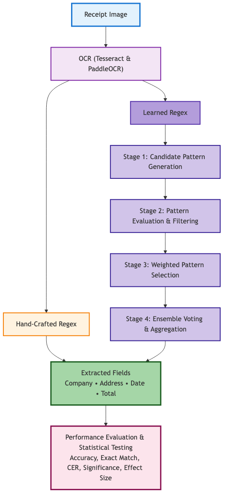

# OCR-Based Receipt Information Extraction with Ensemble Regex and MLOps

## Overview
This project compares two OCR engines — **Tesseract** and **PaddleOCR** — for extracting structured information from scanned receipts. Extraction is performed using both **hand-crafted Regex rules** and a **learned ensemble Regex approach**, which automatically discovers optimized patterns from training data.

The pipeline is designed with **MLOps best practices** using MLflow for experiment tracking, ensuring reproducibility and continuous improvement of the extraction workflow.

---

## Research Questions
1. **OCR Engine Selection:** How do Tesseract and PaddleOCR compare in accuracy across key receipt fields, and are performance differences statistically significant?  
2. **Pattern Learning:** Can automatically learned ensemble Regex patterns outperform hand-crafted baselines when optimized for each OCR engine's error characteristics?

---

## Dataset
**SROIE (Scanned Receipts OCR and Information Extraction)**  
- 974 scanned receipt images in JPEG format  
- Ground truth annotations for four key fields:
  - Company Name
  - Address
  - Date
  - Total Amount  

**Dataset splits:**
- **Training (70%)**: 680 images  
- **Validation (15%)**: 147 images  
- **Test (15%)**: 146 images  

All experiments use the same split for fair comparison.

---

## Pipeline Overview

**End-to-end workflow:**
1. **Image preprocessing**
   - Grayscale conversion
   - Adaptive thresholding (Otsu)
   - Noise reduction (median filtering)
   - Standardization to 224×224 pixels  
2. **OCR extraction**
   - **Tesseract:** LSTM-based OCR with mixed text block mode  
   - **PaddleOCR:** CNN-based model with CTC decoding  
3. **Regex extraction**
   - **Hand-crafted:** Expert-designed patterns per field  
   - **Ensemble-learned:** Multi-stage automated pattern learning with candidate generation, evaluation, selection, and weighted voting  
4. **Evaluation**
   - Field-level accuracy, exact match, CER, and statistical tests (paired t-tests, Mann–Whitney U, effect sizes)

---

## Hand-Crafted Regex Logic (Baseline)

| Field        | Extraction Logic |
|--------------|-----------------|
| Company Name | Top 3–5 lines; search for keywords: `SDN BHD`, `LTD`, `ENTERPRISE`, `TRADING`, `PLT` |
| Address      | Lines after company name with letters and numbers; filter noise keywords (`ITEM`, `PRICE`, `QTY`) |
| Date         | Multiple formats (`DD/MM/YYYY`, `DD-MM-YYYY`, `DD MMM YYYY`); scan bottom-up |
| Total Amount | Currency symbols (`RM`, `$`) + decimal numbers; keywords `TOTAL`, `GRAND TOTAL`; fallback to last monetary value |

---

## Ensemble-Learned Regex
Stages:
1. **Candidate pattern generation:** Extract patterns from training data per field  
2. **Evaluation & filtering:** Discard patterns with accuracy < 0.6 on validation data  
3. **Weighted pattern selection:** Top N patterns chosen based on accuracy, variance, and complexity  
4. **Ensemble voting:** Weighted majority vote to select final value  

---

## Experiments

| Experiment | OCR Engine   | Regex Type          |
|------------|-------------|------------------|
| EXP 1      | Tesseract   | Hand-Crafted      |
| EXP 2      | Tesseract   | Ensemble-Learned  |
| EXP 3      | PaddleOCR   | Hand-Crafted      |
| EXP 4      | PaddleOCR   | Ensemble-Learned  |

All experiments use identical preprocessing, dataset splits, and evaluation protocols. MLflow tracks all experiment parameters and metrics.

---

## Evaluation Metrics
- **Accuracy:** Mean string similarity between predicted and ground truth values  
- **Exact Match Rate:** % of extractions with similarity ≥ 0.8  
- **Character Error Rate (CER):** Edit distance normalized by ground truth length  
- **Statistical Significance:** Paired t-tests and Mann–Whitney U tests, α = 0.05  
- **Effect Size:** Cohen’s d  

---

## Reproducibility & MLOps
- **MLflow:** Tracks experiments, metrics, and hyperparameters  
- **DVC:** Versions large datasets and outputs (data folder excluded from GitHub)  
- **Hydra:** Configures pipelines for different OCR engines and regex strategies  

Follow this sequence to run evaluations, train models, and generate reports:

Run the quick baseline evaluation (run_quick_evaluation.py) to get initial OCR performance metrics.
Evaluate OCR performance with standard regex (analysis.standard_regex.evaluate_ocr_performance).
Generate the standard OCR performance report (analysis.standard_regex.generate_ocr_report).
Train the ensemble regex models for Tesseract and PaddleOCR (src.train_ensemble_pipeline).
Evaluate OCR performance using the trained ensemble regex models (analysis.ensemble_regex.evaluate_ocr_performance).
Generate the ensemble OCR performance report (analysis.ensemble_regex.generate_ocr_report).
Standardize test results for comparative analysis (standardize_test_results.py).
Run comparative analysis between Tesseract and PaddleOCR and generate the final report (src.comparison_analyzer script).
Optionally, run the complete pipeline (run_complete_pipeline.py) to execute all steps in sequence automatically.
